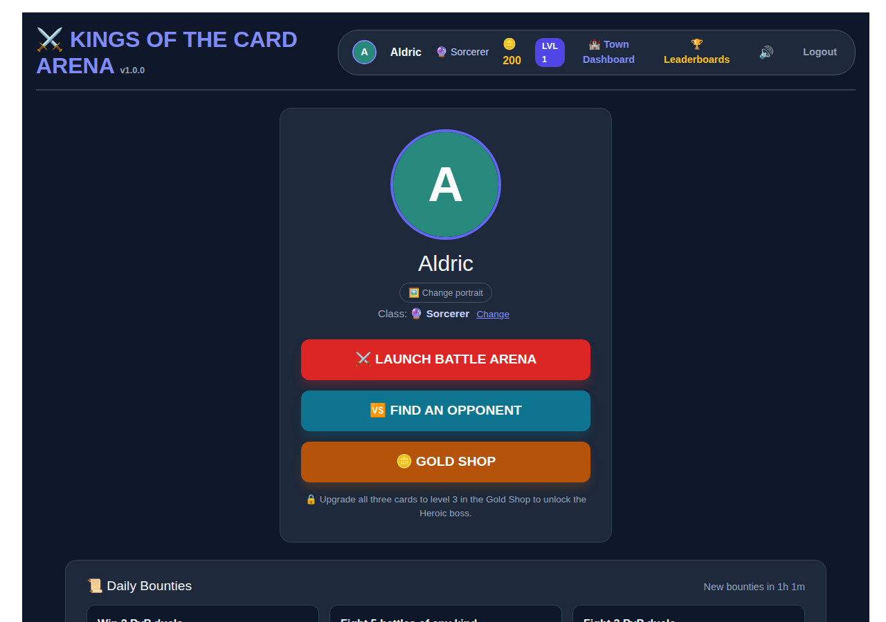
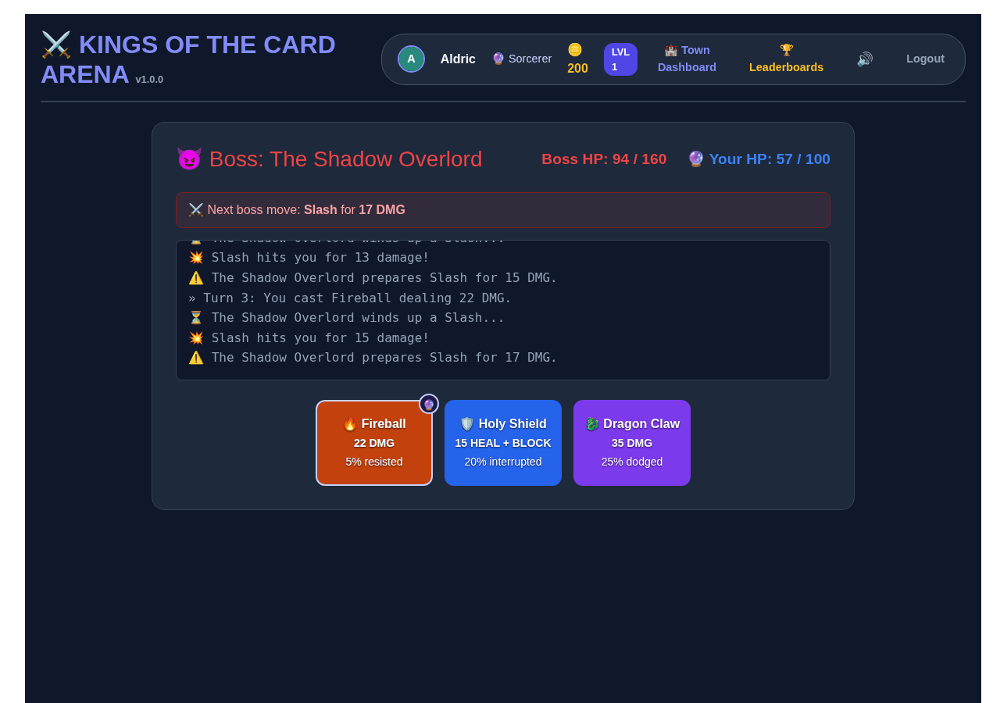
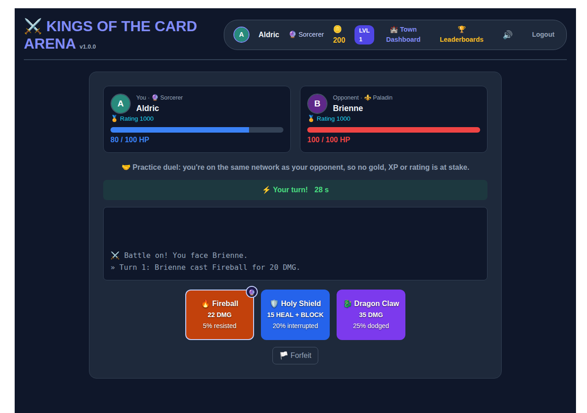
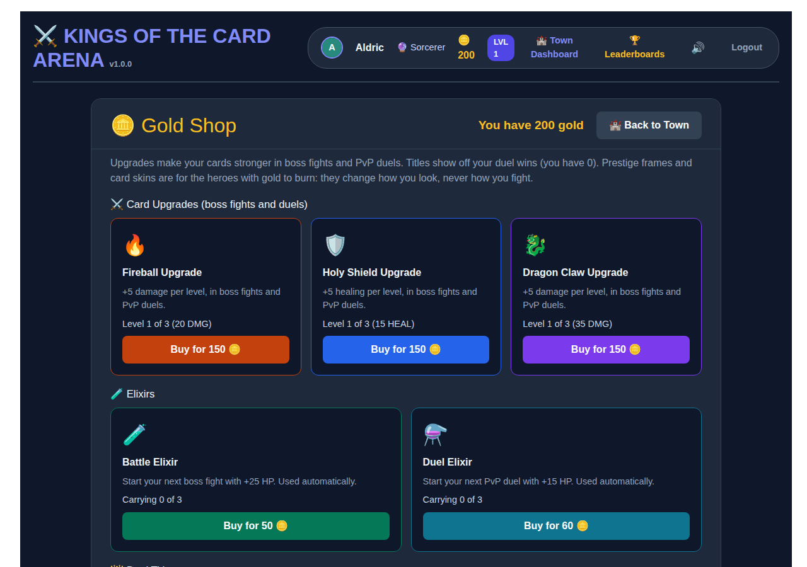
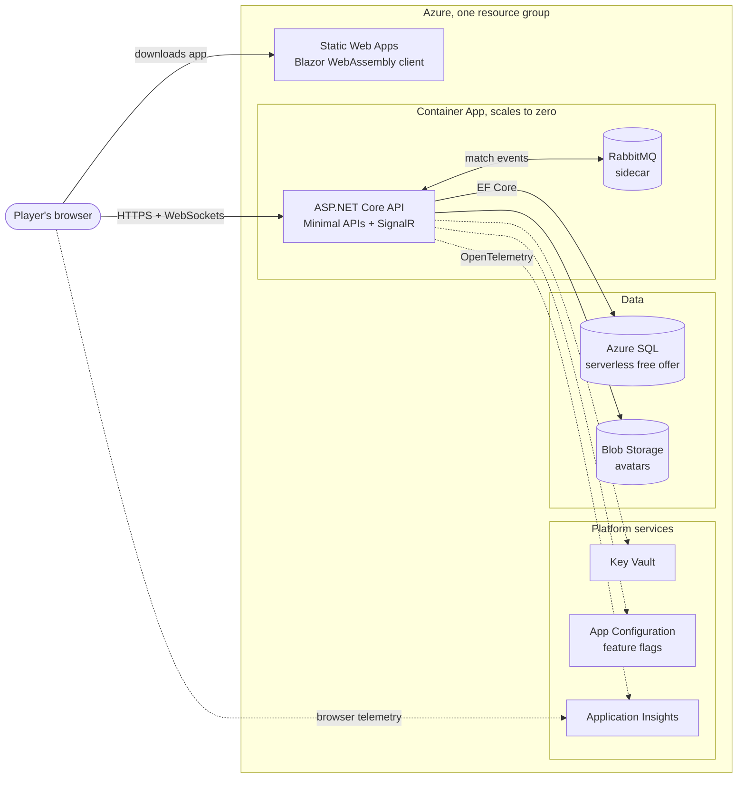

# ⚔️ Kings of the Card Arena

[](https://github.com/scox115/gameappportfolio/actions/workflows/ci.yml)
[](https://github.com/scox115/gameappportfolio/actions/workflows/deploy.yml)


A turn-based card battler built with **ASP.NET Core, Blazor WebAssembly, SignalR and EF Core**, running in **Azure** on free tiers and deployed from GitHub Actions on every merge.

It's a portfolio project, built the way a production service would be: clean architecture, server-authoritative game rules, passwordless cloud access, health checks, OpenTelemetry, a test pyramid from unit to browser to load tests, and an Architecture Decision Record for each significant decision.

**▶ Play it: https://play.scottcoxdev.com** · [System status](https://play.scottcoxdev.com/status)

**New here?** The [five-minute case study](docs/case-study.md) covers the architecture, the key decisions and the numbers, with a live duel recorded in two browsers.

<sub>The API scales to zero when nobody is playing, so the first visit after a quiet spell can take a minute or two to wake up.</sub>

| Town | Boss fight |
| --- | --- |
|  |  |
| **Live duel over SignalR** | **Gold Shop** |
|  |  |

## The game

- **Boss fights:** play Fireball, Holy Shield or Dragon Claw against a boss that announces its next move, enrages at low health and can resist, dodge or interrupt your cards. A Heroic boss unlocks once every card is fully upgraded.
- **Live duels:** find an opponent with the same gold wager and fight turn by turn in real time, with 30-second turns. Results move an Elo rating.
- **Progression:** three hero classes with their own perks, card upgrades and elixirs in the Gold Shop, daily bounties, win streaks, titles, cosmetic frames and card skins.
- **Leaderboards:** overall and per class, with match history and daily arena stats.

## What it demonstrates

| Area | How |
| --- | --- |
| **Architecture** | Clean Architecture: a framework-free domain (`Game.Core`) with rich entities, infrastructure behind interfaces, Minimal APIs on top ([ADR 0001](docs/adr/0001-clean-architecture.md)) |
| **Game integrity** | The server rolls every die and the client only picks a card ([ADR 0002](docs/adr/0002-server-authoritative-battles.md)); optimistic concurrency stops lost gold ([ADR 0004](docs/adr/0004-optimistic-concurrency.md)); per-IP rate limits and anti-cheat rules on duels |
| **Security** | ASP.NET Core Identity, 15-minute JWTs, rotating refresh tokens with reuse detection, one active browser per account ([ADR 0005](docs/adr/0005-identity-jwt-refresh-tokens.md)); a strict Content Security Policy and HSTS, tested in the browser ([ADR 0015](docs/adr/0015-security-headers.md)); avatar uploads checked by magic bytes and size; players can download everything stored about them and delete their account for good ([ADR 0020](docs/adr/0020-account-export-and-deletion.md)); role-based admin tools to suspend players and correct gold, with every action in an audit log ([ADR 0021](docs/adr/0021-admin-roles-and-audit-log.md)); hero names checked against a block list that sees through look-alike spellings, and players can report a name or portrait for an admin to rename the hero or remove it ([ADR 0024](docs/adr/0024-moderation-and-reports.md)); password reset by email through Azure Communication Services, with one-time hashed links ([ADR 0022](docs/adr/0022-account-recovery-by-email.md)); optional two-factor sign-in with an authenticator app, codes that work once, lockout on guessing and hashed recovery codes ([ADR 0025](docs/adr/0025-two-factor-sign-in.md)) |
| **Real time** | SignalR hubs for duels and instant sign-out, with a background worker enforcing turn timeouts; the lobby and live messages are shared through SQL so the API runs on several replicas ([ADR 0027](docs/adr/0027-scale-out.md)) |
| **Messaging** | RabbitMQ events build match history and daily stats; a transactional outbox so no event is lost, an idempotent consumer, retries, and a game that keeps working if the broker is down ([ADR 0003](docs/adr/0003-rewards-synchronous-messaging-for-read-models.md), [ADR 0023](docs/adr/0023-transactional-outbox.md)) |
| **API design** | URL versioning with deprecation and sunset headers ([ADR 0009](docs/adr/0009-url-segment-api-versioning.md)), problem+json errors, Swagger per version |
| **Performance** | Output caching evicted automatically by EF Core saves ([ADR 0010](docs/adr/0010-output-caching-with-tag-eviction.md)); load-tested at about 200 simultaneous players on 0.5 CPU ([report](docs/load-testing.md)) |
| **Operations** | A public [status page](https://play.scottcoxdev.com/status) with live health checks, the running build, recent releases and the last restore drill ([ADR 0018](docs/adr/0018-status-page.md)); a staging copy of the whole game, built from the same Bicep template, that every commit reaches before production, and a preview site for each pull request ([ADR 0026](docs/adr/0026-staging-and-previews.md)); blue-green releases: each build is tested on its own Container Apps revision before players move to it, with one-click rollback ([ADR 0016](docs/adr/0016-blue-green-deploys.md)); a monthly restore drill that proves the database backups work and measures recovery time, with runbooks ([ADR 0017](docs/adr/0017-restore-drills.md)); `/health/live` and `/health/ready`, OpenTelemetry traces and metrics to Application Insights, browser telemetry (screens, load times, API calls traced end to end into the API, and front-end crashes) in the same resource ([ADR 0019](docs/adr/0019-browser-telemetry.md)), email alerts, a scheduled cleanup worker, feature flags you can flip in Azure without a deploy ([ADR 0011](docs/adr/0011-feature-flags.md)) |
| **Cloud** | Bicep for every resource, GitHub OIDC (no stored Azure credentials), managed identity to SQL, Storage and Key Vault ([ADR 0008](docs/adr/0008-passwordless-azure-access.md)), all on free tiers ([ADR 0007](docs/adr/0007-free-tier-azure-hosting.md)) |
| **Testing** | 480+ automated tests: domain, API, Aspire wiring, Playwright browser tests with axe-core WCAG 2.1 AA checks, and k6 load tests ([ADR 0012](docs/adr/0012-testing-strategy.md)) |
| **Developer experience** | One command runs everything locally with .NET Aspire ([ADR 0013](docs/adr/0013-aspire-for-local-orchestration.md)); Dependabot and a vulnerable-package gate in CI |

## Architecture



The API reaches SQL, Storage, Key Vault and App Configuration as a managed identity, so no connection string holds a password. GitHub Actions builds the API image, deploys `infra/main.bicep` and the client to staging, smoke-tests it, then does the same in production with the image staging tested. Pull requests get a preview of the client. See [docs/azure-deployment.md](docs/azure-deployment.md).

### Solution layout

```
1.Core/Game.Core                    Domain: entities, battle rules, rating, shop, events. No framework references.
2.Infrastructure/Game.Infrastructure EF Core DbContext, migrations, Identity user, Blob storage, read-model projector
3.BackendAPI/Game.Api               Minimal API endpoints, SignalR hubs, auth, workers, caching, health, telemetry
4.Frontend/Game.Client              Blazor WebAssembly client
5.Tests/                            Core, API, AppHost and Playwright browser tests
6.Aspire/Game.AppHost               .NET Aspire orchestration for local runs
infra/                              Bicep template and one-time Azure setup script
loadtest/                           k6 load test and its Docker Compose environment
docs/                               Guides and Architecture Decision Records
```

## Run it locally

You need the [.NET 10 SDK](https://dotnet.microsoft.com/download) and [Docker Desktop](https://www.docker.com/products/docker-desktop/). Then:

```powershell
dotnet run --project 6.Aspire/Game.AppHost
```

That starts SQL Server, Azurite and RabbitMQ in Docker, the API on http://localhost:5005 and the client on http://localhost:5091, and opens the Aspire dashboard with logs, traces and metrics. In Visual Studio, set **Game.AppHost** as the startup project and press F5. The manual Docker Compose route is in [docs/local-development.md](docs/local-development.md).

## Run the tests

```powershell
dotnet test --filter "Category!=Browser"   # domain, API and AppHost tests, no Docker needed
# Set TEST_SQLSERVER to a connection string to also run the concurrency and migration tests on SQL Server (CI always does).
dotnet test 5.Tests/Game.E2E.Tests          # Playwright browser tests (installs Chromium on first run)
```

The k6 load test is described in [docs/load-testing.md](docs/load-testing.md).

## Documentation

- [Case study](docs/case-study.md): the five-minute tour of the architecture, decisions and numbers
- [Architecture Decision Records](docs/adr/README.md): why it is built this way
- [Local development](docs/local-development.md): running, settings, health, caching, feature flags
- [Azure deployment](docs/azure-deployment.md): costs, security choices, one-time setup, troubleshooting
- [API versioning](docs/api-versioning.md)
- [Load testing](docs/load-testing.md): method and results

## License

© 2026 Scott Cox. The code is released under the [MIT License](LICENSE); third-party components are listed in [THIRD-PARTY-NOTICES.md](THIRD-PARTY-NOTICES.md). Playing the hosted game is covered by its [Terms of Service](https://play.scottcoxdev.com/terms) and [Privacy Policy](https://play.scottcoxdev.com/privacy).
