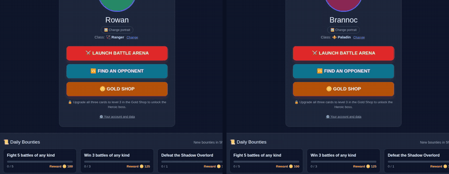
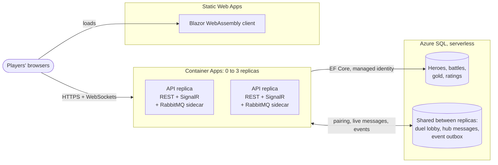
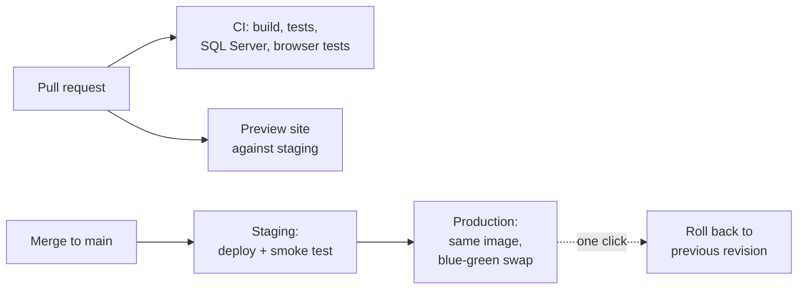

# Case study: Kings of the Card Arena

A real-time card battler built as if it were a production service: a .NET 10 API and a Blazor WebAssembly client, live in Azure, deployed on every merge, and run for close to nothing. This page is the five-minute tour: what it is, how it's built, the decisions that shaped it and the numbers behind them. Each decision links to its full Architecture Decision Record (ADR).

**▶ [Play it](https://play.scottcoxdev.com)** · [Source and setup](../ReadMe.md) · [All 29 ADRs](adr/README.md)

*Two browsers, two heroes, one live duel. Each card goes to the server over SignalR, the server plays the turn and both screens update.*

## At a glance

| | |
| --- | --- |
| **Stack** | C# / .NET 10, ASP.NET Core Minimal APIs, SignalR, EF Core, Blazor WebAssembly, RabbitMQ, Azure SQL |
| **Cloud** | Azure Container Apps, Static Web Apps, SQL, Blob Storage, Key Vault, App Configuration, Application Insights; all in Bicep |
| **Delivery** | GitHub Actions: CI on every pull request, a preview site per pull request, staging then production on every merge, blue-green releases |
| **Quality** | 480+ automated tests (domain, API, browser with accessibility checks, load), the concurrency tests on a real SQL Server in CI |
| **Running cost** | Free tiers throughout; the API scales to zero when nobody is playing |
| **Scale** | About 200 players fighting at once per 0.5 CPU replica, up to three replicas |

## The brief

Build something small enough to finish but hard in the ways real services are hard: players acting at the same time, money-like state (gold) that must never be lost or duplicated, live connections, and a public deployment that has to stay up and stay cheap. Then treat it like a team's product, with every significant decision written down, tested, and reversible.

## How it runs

## Decisions worth talking about

### 1. The server plays every battle

- **Problem:** in a game with gold and ratings, anything the browser decides can be faked.
- **Choice:** the client only says which card it picked. The server rolls every die, plays the boss's move, saves the battle after each turn and pays rewards once, in the same request that ends the fight. Optimistic concurrency on players and battles means two tabs can't spend the same gold twice.
- **Trade-off:** every turn is a round trip. At these turn speeds that's invisible. ([ADR 0002](adr/0002-server-authoritative-battles.md), [ADR 0004](adr/0004-optimistic-concurrency.md))

### 2. Free tiers, scaled to zero

- **Problem:** the game has to stay online indefinitely on a personal budget, using the services a real .NET team would use.
- **Choice:** Container Apps on the consumption plan with a minimum of zero replicas, the Azure SQL free offer (serverless, auto-pausing), Static Web Apps Free, and RabbitMQ as a sidecar rather than a paid broker. No stored Azure credentials: GitHub signs in with OIDC and the API reaches SQL, Storage and Key Vault as a managed identity.
- **Trade-off:** the first visit after a quiet spell waits for the API and database to wake. That's stated on the front page rather than hidden. ([ADR 0007](adr/0007-free-tier-azure-hosting.md), [ADR 0008](adr/0008-passwordless-azure-access.md))

### 3. Scaling out without paying for it

- **Problem:** one replica was a single point of failure, and three things lived in its memory: the duel lobby, which players were connected where, and the event relay.
- **Choice:** move the shared state into the database the game already has. The lobby is a table, and pairing is two deletes in one save with no locks: if another replica got there first, the save fails and the next player is tried. SignalR messages for a player on another replica go through a small table that each busy replica reads four times a second. Browsers connect straight over WebSockets, so no sticky sessions are needed and blue-green releases keep working.
- **Trade-off:** up to a quarter of a second of extra delay between replicas, instead of about $50 a month for Azure SignalR Service. The Redis backplane is one setting away if that changes. ([ADR 0027](adr/0027-scale-out.md))

### 4. No event is ever lost

- **Problem:** match history and daily stats are built from RabbitMQ events. Publishing after the database save can lose an event if the process dies in between.
- **Choice:** a transactional outbox. The event row is committed in the same save as the match, and a relay publishes it with broker confirms and deletes it only when confirmed. With several replicas, each relay claims rows with a concurrency token so no two send the same one. The consumer ignores repeats, so at-least-once delivery is safe.
- **Trade-off:** one extra table and a background worker. Rewards never depend on the broker, so the game keeps working if it's down. ([ADR 0023](adr/0023-transactional-outbox.md), [ADR 0003](adr/0003-rewards-synchronous-messaging-for-read-models.md))

### 5. Every release is rehearsed

- **Problem:** a bad deploy to a live game is visible to every player at once.
- **Choice:** every merge deploys to a full staging copy built from the same Bicep template, then promotes the exact image staging tested. In production the new build starts as its own Container Apps revision with no traffic, is smoke-tested against the real database, and only then takes over. The previous revision stays deployed (scaled to zero) for a one-click rollback. Pull requests get their own preview site.
- **Trade-off:** a second copy of the infrastructure, which on free tiers costs almost nothing. ([ADR 0026](adr/0026-staging-and-previews.md), [ADR 0016](adr/0016-blue-green-deploys.md))

### 6. Testing the parts that break under load

- **Problem:** the fast in-memory test database has no transactions, so it can't catch races.
- **Choice:** the tests that depend on the database engine run on SQLite and on a real SQL Server that CI starts for every pull request, built from the real migrations. A test also fails if the model changed without a migration.
- **Trade-off:** about ten seconds more per CI run. ([ADR 0028](adr/0028-sql-server-in-ci.md), [ADR 0012](adr/0012-testing-strategy.md))

## A bug worth telling

While checking scale-out with two real API processes sharing one SQL Server, a duel request failed with an `ArgumentNullException`. The lobby code checked whether a player was still waiting and then loaded their row in a second query; another replica could pair that player in the gap. None of the tests had caught it, because the in-memory database never runs two things at once.

The fix was one query instead of two. The lasting change was making sure it can't come back unnoticed: the 40-player lobby test now runs on SQL Server in CI. With the fix undone, it fails on SQL Server three runs out of three while still passing on SQLite.

## The numbers

**One replica under load** (k6, a 0.5 CPU / 1 GiB container, every simulated player busy all the time; [full report](load-testing.md)):

| Players at once | Requests/s | Median | p95 | Duel turn p95 | Errors |
| --- | --- | --- | --- | --- | --- |
| 60 | 30 | 7 ms | 18 ms | 38 ms | 0% |
| 200 | 103 | 11 ms | 203 ms | 285 ms | 0% |
| 300 | 129 | 93 ms | 324 ms | 422 ms | 0% (straining) |

**Two replicas sharing one database** (two API processes on SQL Server, measured locally on 2026-10-07):

- A player waiting on one replica was paired from the other, and heard about it within 130 to 580 ms.
- Moves crossed between replicas in 180 to 260 ms.
- 40 players joining through both replicas at once became exactly 20 duels, with nobody left waiting and nobody paired twice.
- 300 match events sent through two relays at once were each delivered exactly once, split 150 and 150.

**Running cost:** the API, database and client sit on free grants and scale to zero when idle; the remaining services (Storage, Key Vault, telemetry capped inside its free allowance) cost cents a month. ([ADR 0007](adr/0007-free-tier-azure-hosting.md))

## What it would take to grow

- **Put the API and database in one region.** The database sits in Central US because Azure wasn't taking new SQL servers in the API's region (East US 2) at setup, which adds a cross-region round trip to every query.
- **Swap the SQL backplane for Azure SignalR Service or Redis** once the extra delay or the database load matters more than the monthly cost. Both are a configuration change.

## Where to look in the code

| To see | Open |
| --- | --- |
| Battle rules, with no framework code | [`1.Core/Game.Core/Battles`](../1.Core/Game.Core/Battles) |
| The duel lobby and pairing | [`3.BackendAPI/Game.Api/Hubs/PvpMatchmaker.cs`](../3.BackendAPI/Game.Api/Hubs/PvpMatchmaker.cs) |
| Passing SignalR messages between replicas | [`3.BackendAPI/Game.Api/ScaleOut`](../3.BackendAPI/Game.Api/ScaleOut) |
| The outbox relay | [`3.BackendAPI/Game.Api/Messaging`](../3.BackendAPI/Game.Api/Messaging) |
| All of the Azure infrastructure | [`infra/main.bicep`](../infra/main.bicep) |
| The release pipeline | [`.github/workflows`](../.github/workflows) |
| Tests that run two replicas against one database | [`5.Tests/Game.Api.Tests/ScaleOutTests.cs`](../5.Tests/Game.Api.Tests/ScaleOutTests.cs) |
